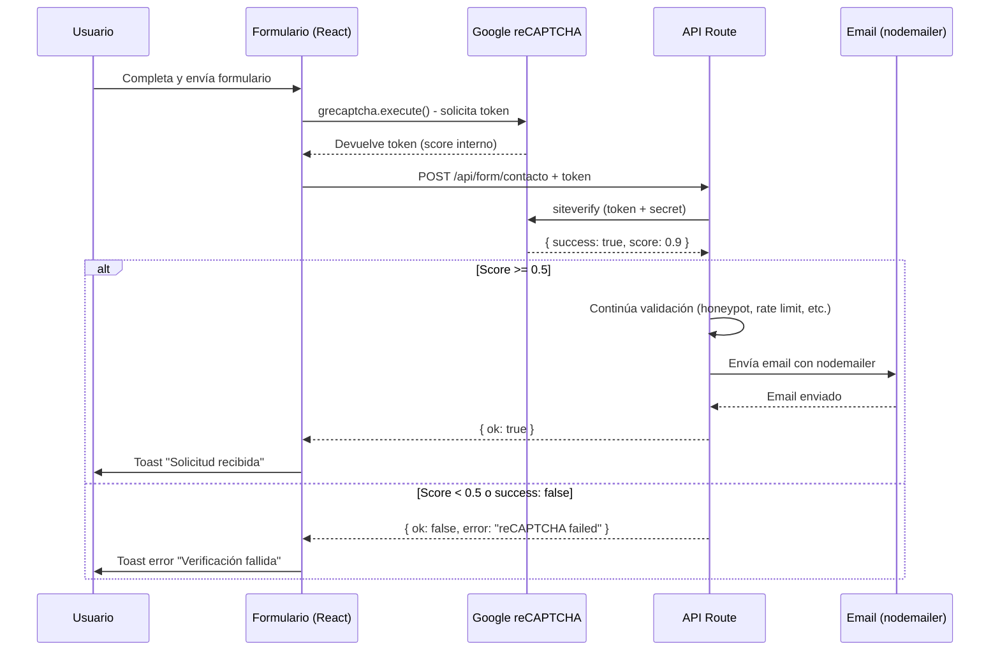

# Integración de Google reCAPTCHA v3 en Vision360IA

## 📋 Resumen de Cambios

Se ha integrado Google reCAPTCHA v3 en el formulario de contacto para protección contra bots y spam.

---

## 📁 Archivos Modificados

### 1. **`src/components/ui/contact-slideover.tsx`** (Frontend)

#### Cambios realizados:

- **Nuevo `useEffect` (líneas ~102-125)**: Carga el script de reCAPTCHA v3 de forma dinámica
  - Solo se ejecuta en el cliente (`typeof window !== 'undefined'`)
  - Verifica que no esté ya cargado para evitar duplicados
  - Usa la variable de entorno `NEXT_PUBLIC_RECAPTCHA_SITE_KEY`

- **Modificación de `onSubmit` (líneas ~155-172)**: 
  - Antes de enviar el formulario, ejecuta `window.grecaptcha.execute()` para obtener un token
  - El token se genera con la acción `'submit'`
  - Se incluye el token en el body del fetch: `token: recaptchaToken`
  - Mantiene toda la lógica existente (spinners, toasts, reset, etc.)
  - En caso de error de reCAPTCHA, continúa sin token (modo degradado)

---

### 2. **`src/app/api/form/contacto/route.ts`** (Backend)

#### Nuevas interfaces:

```typescript
interface FormData {
  // ... campos existentes ...
  token?: string; // 🔐 Token de reCAPTCHA v3
}

interface RecaptchaVerifyResponse {
  success: boolean;
  score?: number;
  action?: string;
  'error-codes'?: string[];
}
```

#### Nueva función `validateRecaptcha()` (líneas ~50-95):

```typescript
async function validateRecaptcha(token: string): Promise<boolean>
```

**Qué hace:**
1. Verifica que exista `RECAPTCHA_SECRET_KEY` en variables de entorno
2. Si no hay secret key, devuelve `true` (permite desarrollo sin reCAPTCHA)
3. Si no hay token, devuelve `false`
4. Hace un POST a `https://www.google.com/recaptcha/api/siteverify` con:
   - Header: `Content-Type: application/x-www-form-urlencoded`
   - Body: `secret=<SECRET>&response=<TOKEN>`
5. Parsea la respuesta JSON de Google
6. Verifica que `success === true`
7. Verifica que `score >= 0.5` (umbral de seguridad: 0.0 = bot, 1.0 = humano)
8. Devuelve `true` solo si pasa ambas validaciones
9. En caso de error de red, devuelve `false`

#### Modificación del handler POST (líneas ~310-330):

1. Extrae el token del body: `const { token, ...formDataRaw } = rawData;`
2. **VALIDA reCAPTCHA ANTES de procesar cualquier dato**:
   ```typescript
   const isRecaptchaValid = await validateRecaptcha(token);
   ```
3. Si la validación falla, devuelve error 400:
   ```json
   {
     "ok": false,
     "error": "reCAPTCHA validation failed",
     "message": "Verificación de seguridad fallida..."
   }
   ```
4. Si pasa, continúa con toda la lógica existente (honeypot, rate limiting, validación, email)

---

### 3. **`src/types/recaptcha.d.ts`** (NUEVO)

Declaración de tipos TypeScript para `window.grecaptcha`:

```typescript
interface Window {
  grecaptcha: {
    ready: (callback: () => void) => void;
    execute: (siteKey: string, options: { action: string }) => Promise<string>;
  };
}
```

---

### 4. **`.env.local`** y **`.env.example`** (Configuración)

Nuevas variables de entorno añadidas:

```bash
# Clave pública (visible en el cliente)
NEXT_PUBLIC_RECAPTCHA_SITE_KEY=6LfoFxcsAAAAAJFJ1kj2TiCbeuzmLpTJo9XcOfAw

# Clave secreta (solo en servidor)
RECAPTCHA_SECRET_KEY=6LfoFxcsAAAAAJWapK3iiUYhqQ3pkK_IZfaacp6H
```

**IMPORTANTE**: En Vercel, estas variables deben configurarse en:
- Dashboard → Settings → Environment Variables
- Añadir ambas para: Production, Preview y Development

---

## 🔄 Flujo Completo (Usuario → Validación → Email)



---

## ✅ Checklist de Deployment en Vercel

1. [ ] Configurar variables de entorno en Vercel Dashboard:
   - `NEXT_PUBLIC_RECAPTCHA_SITE_KEY` = `6LfoFxcsAAAAAJFJ1kj2TiCbeuzmLpTJo9XcOfAw`
   - `RECAPTCHA_SECRET_KEY` = `6LfoFxcsAAAAAJWapK3iiUYhqQ3pkK_IZfaacp6H`
   
2. [ ] Añadir dominio de producción en Google reCAPTCHA Admin:
   - Ir a: https://www.google.com/recaptcha/admin
   - Añadir tu dominio Vercel (ej: `vision360ia.vercel.app`)

3. [ ] Hacer deploy y probar en producción

---

## 🧪 Testing

### En local:
```bash
npm run dev
```
1. Abrir formulario de contacto
2. Abrir DevTools → Network
3. Enviar formulario
4. Verificar que el request incluye `token` en el body
5. Verificar que el servidor responde con éxito

### En producción:
1. Probar envío normal → Debe funcionar
2. Probar sin JavaScript → Debe fallar con mensaje de error
3. Verificar logs de Vercel para ver scores de reCAPTCHA

---

## 🔒 Seguridad

- **Score mínimo**: 0.5 (configurable en `validateRecaptcha()`)
- **Timeout**: 3 segundos de carga de reCAPTCHA antes de fallar
- **Modo degradado**: Si reCAPTCHA no carga, el formulario continúa funcionando pero sin token (servidor lo rechazará)
- **Secret key**: NUNCA se expone al cliente (solo en servidor)
- **Site key**: Pública, puede estar en el código frontend

---

## 📝 Notas

- reCAPTCHA v3 funciona **invisiblemente** (sin CAPTCHA visual para el usuario)
- El score se calcula automáticamente por Google basándose en el comportamiento del usuario
- No afecta la UX: el usuario no ve ningún checkbox ni desafío
- Compatible con todos los navegadores modernos
